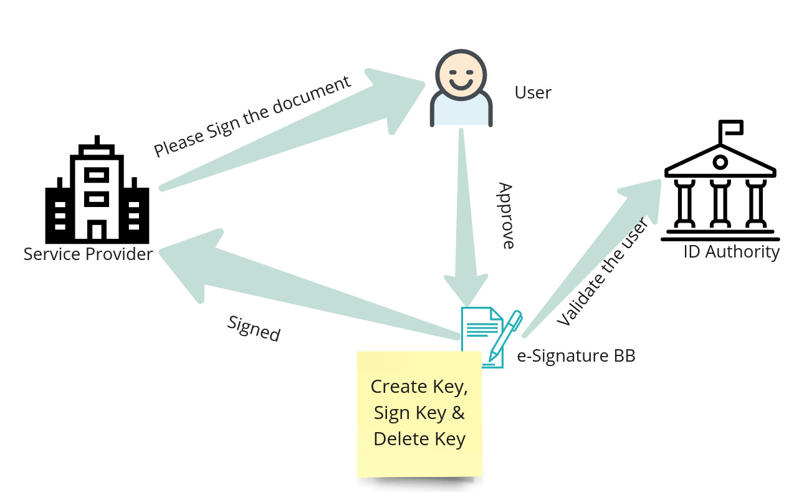
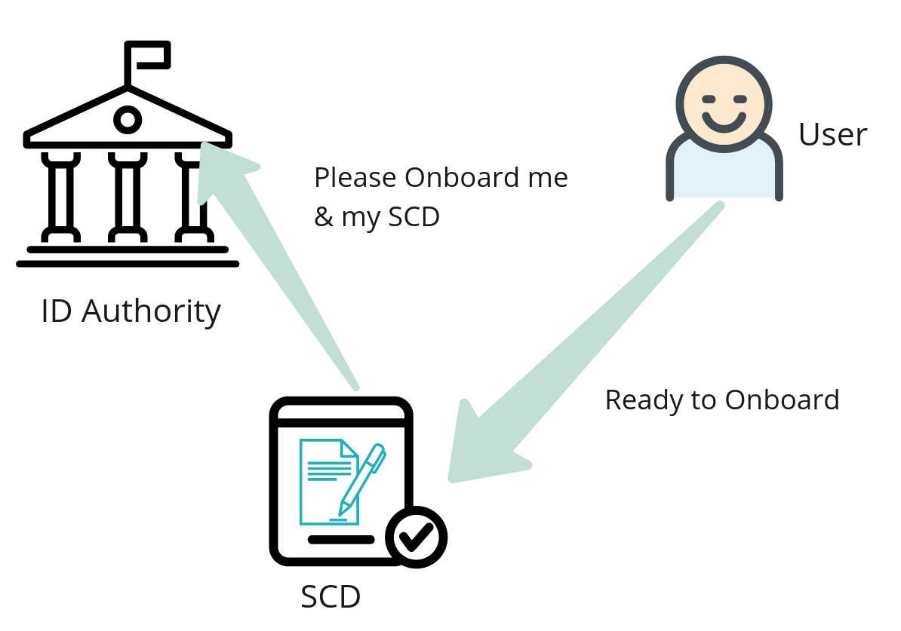
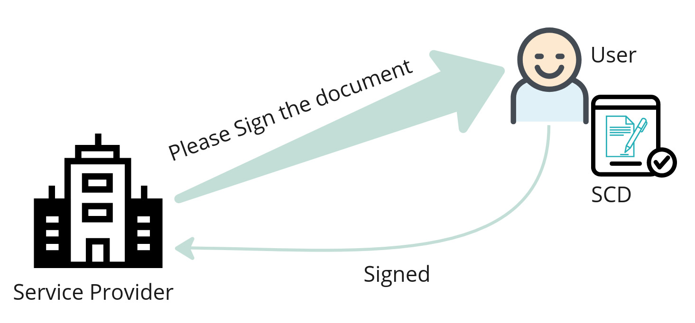

# 2 Description

eSignature Building Block provides the necessary functionalities to bring handwritten signatures to the digital world. Handwritten signatures have served as a way to agree/witness a given document, yet, in today's digital world most documents are in digital form. The digital form varies between structured (XML, JSON) and unstructured documents (PDF, Word, Image, CSV, Spreadsheet).  eSignatures can be added to digital documents similar to handwritten signatures achieving the same functionality.

Additionally, eSignatures improve user experience in managing the signing process as the same can be embedded directly in e-Services, leaving out the need to print out forms, sign on paper, scan, and upload/send.

eSignature provides a considerable advantage over handwritten signatures because of the availability for verification at any point in time. This allows for remote validation of signatures, content (content being the same as that during signing), identity, and time. This assurance allows us to trust a signed document remotely and can be used for legally binding agreements. Sample use cases include:

* Submitting applications to Government agencies (e.g. Child Care, Residence Registration, Marriage, etc.)
* Purchase and use banking services (i.e. making transfers, adding transfer limits, applying for loans)
* Purchasing telecom services (i.e. purchase SIM/eSIM, change contract, add a TV subscription)
* Purchase utility services (i.e. new contract for electricity, gas)
* Purchase insurance contract

With eSignature there is no need to print documents on paper anymore, saving a lot of paper and promoting a green lifestyle. This can also save money and can be calculated with an[ online calculator ](https://blog.dokobit.com/news/e-signature-calculator-check-out-how-much-you-could-save/)designed for the eSignature practice.

## 2.1 Current scope

* Ability to support eSignature for everyone.
* Ability to support eSignature through a specialized user device/card.
* The ability for third-party services (including other Building Blocks) to interact, sign, and verify the eSignatures in a standardized model.

### 2.1.1 Actors

* Users: people or applications (delegated by a user) who use the eSignature Building Block to give eSignatures.
* Services: third-party services that require a user eSignature to provide the service.
* Auditor: individual or organization that reviews the platform for any misuse (intentional or unintentional)
* Administrator: individual or team that configures the eSignature Building Block and is responsible for ensuring the functioning of the Building Block.
* Certification Authority: a certification authority that can issue a certificate as X509.
* Timestamp Authority: a trusted third party who can provide certified time.&#x20;

## 2.2 eSignature Lifecycle

There are two lifecycles available for the eSignature Building Block. Both mechanisms have their own unique advantages, therefore it is recommended to follow both for an inclusive approach.&#x20;

### 2.2.1 One-Time Signature Approach

One-time signatures are one of the easiest ways to get large-scale adoption of eSignatures. This approach does not require any device to be owned by the end user.  This approach relies on the work done by the ID Building Block to authenticate an end user.

<figure><figcaption>
One Time Signature
</figcaption></figure>

* User authenticates against the ID Building Block
* The user is redirected to the eSignatures Building Block
* A new key pair is created in the HSM (Hardware Security Module)
* An X509 Certificate is issued with the details from the ID Building Block (Name, Age, Gender, Location)&#x20;
* The new key is used to timestamp and sign the document
* The X509 certificate is set to expire 1 minute from the time of creation&#x20;
* The signed document is sent
* The private key is deleted from the HSM

### 2.2.2 SCD-based approach

The SCD (Signature Creation Device) is a personal device of the user. It could be a Mobile Phone, SIM card, Smart Card, Secure SD Card, USB Storage device, NFC Card, etc. The SCD device can be used to store the keys for long-term usage. This allows the user to interact with the ID Building Block once and create a key on the SCD. This key then can be used for signing any document without interacting with the ID Building block.

<figure><figcaption>
SCD Onboard
</figcaption></figure>

The binding of the private key with the user is called On-boarding. In this process, a user is authenticated and his key is created on the SCD.&#x20;

* User authenticates against the ID Building Block
* The user is redirected to the eSignature page where his SCD device is detected
* The user is asked to select a valid SCD device and enter its security PIN/Biometric/One Time Password
* The eSignature Building Block interacts with the SCD (protocols are left open for implementation) to create a  Key Pair
* A CSR (Certificate Signing Request) is created&#x20;
* This request is sent to the eSignature Building Block
* The Building Block verified the ID Building Block token and the data in the CSR
* If they match then the CSR is converted to an X509 certificate and the same is issued back to the device

<figure><figcaption>
SCD Based Signature
</figcaption></figure>

The key created on the SCD device can be used by the user to digitally sign any of the documents.

* The third-party who needs to sign the document will be redirected to the eSignature Building Block
* The eSignature Building Block will ask for the pseudonym (eSignature handle) from the user
* The user provides the pseudonym to the eSignature Building Block
* The eSignature Building Block sends a notification to the SCD (Internal Protocol)
* The user is shown his choice to sign or not to sign
* Once the user signs the SCD will send the signature to the third-party&#x20;
* The Digital Signature will then be attached to the given document in one of the supported formats as described by the eSignature Building Block&#x20;

## 2.3 Current Scope

### 2.3.1 This Building Block must enable the user to

* View and provide consent to the document that is about to be signed
* Register the user's Signature Creation Device (SCD)&#x20;
* Confirm the signature with a PIN code on the user's SCD&#x20;
* View user's SCD-s and certificates
* Digitally sign the documents (PDF, Word, Excel, JSON, XML, Image)
* Use a personal device to store the keys safely
* Ability to sign the document where the user has no device
* Ability to sign a document without the involvement of ID Building Block
*   Ability to sign a document using only the ID issued by the ID Building Block

    User
* Ability to view the list of signings performed

### 2.3.2 This Building Block must enable other eServices  to

* Invoke eSignatures to obtain a digital signature
* Sign the digital document in the desired eSignature format
* Allow a safe async way to obtain signatures
* A simple-to-use library to validate the eSignature

### 2.3.3 This Building Block must enable an auditor to

* Retrieve and review specific audit data
* Validate and get signatures on any audit data
* Audit cryptographic functioning and compliance for auditing and key security

### 2.3.4 This Building Block must enable the administrator to

* Configure the system without intervening with the signature process
* Administer without modification or tampering with the data or key security

## 2.4 eSignature library

eSignature Building Block will provide a helper library for the Services. The helper library could be used to integrate eSignatures faster.&#x20;

* Get digital document digest to be sent to eSignature Building Block.  Obtaining just the hash reduces the storage overhead and also avoids the privacy concern of sending the original document.
* Embedding received eSignature back into the document or attaching it in case of detached signatures.&#x20;
* Validate digitally signed documents and the validity of the certificate.

## 2.5 eSignature formats

Supports the following signature formats:

* [XAdES -  XML signatures](https://www.w3.org/TR/XAdES/)
* [PAdES - PDF signatures](https://www.iso.org/standard/67937.html)
* [CAdES - CMS Signatures](https://www.rfc-editor.org/rfc/rfc5126)
* [ASIC - Interoperable signatures](https://www.etsi.org/deliver/etsi\_en/319100\_319199/31916201/01.01.01\_60/en\_31916201v010101p.pdf)
* [JWS (RFC 7515)](https://www.rfc-editor.org/rfc/rfc7515)

## 2.6 Authentication and Security

In order for eSignatures to be secure and adhere to privacy regulations the eSignature Building Block uses the following levels of authentication,

* Authentication via ID Building Block: the service that uses eSignature will have to authenticate the user against the ID Building Block.
* Unique pseudonym: the service is redirected to a webpage on the eSignature portal where the user can enter a unique pseudonym known only to the user to start the signing process (without a pin, the signing will not be complete).
* Asking for a PIN code on the user's device: eSignature Building Block will send a request to the user's device so that the user can confirm the signing request with a PIN.
* The signature will be returned using an internal API protected by the Information Mediation Building Block.

## 2.7 Audit Trail and Compliance

eSignature Building Block must log all signing transactions to be compliant with current regulations. The minimum details to be logged are:

* User's identity without revealing personally identifiable information.
* Document digest.
* Timestamp of the signing.
