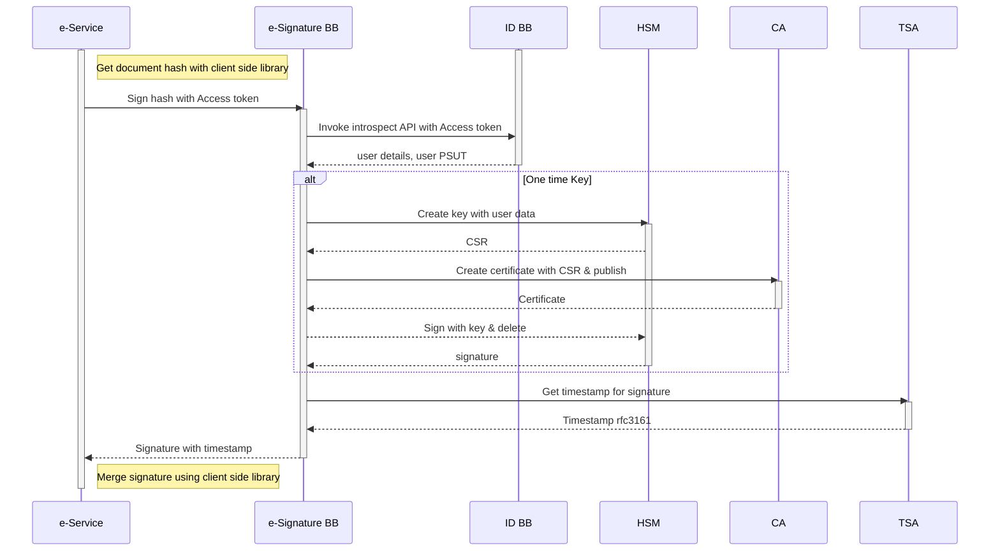
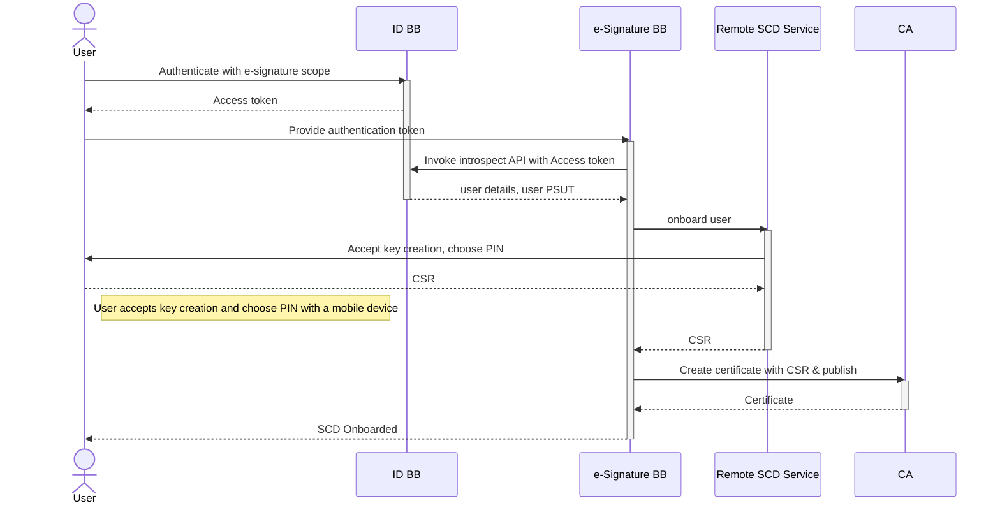
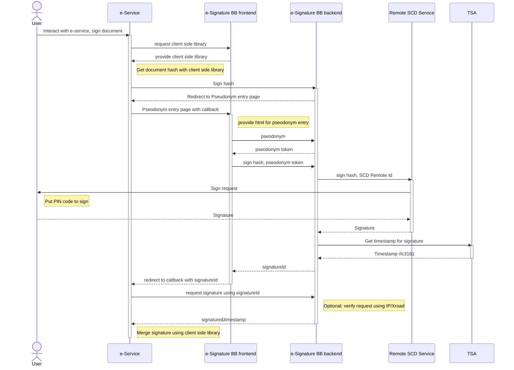

# 9 Internal Workflows

### 9.1 Workflow for onetime signing

This internal workflow is used by the eSignature BB to give onetime signature.

Workflow is kicked off by a 3rd party using eSignature client library to get a digest of document to be signed

After submitting the call to eSignature BB, it will first check if the authentication token by ID BB is valid

If required by the BB configuration, it will also check if the Payment token supplied by the request is valid.

Then a Host Security Module (HSM) hardware is used to generate a temporary keypair. From that keypair, public part is exported as Certificate Signing Request (CSR)

CSR is the submitted to a CA instance that will generate and publish a short lived (1 minute) certificate based on supplied CA.

After certificate has been created the private key in HSM is used to sign a document digest.

After Digest is signed, timestamp is requested on the signature from timestamping service.

After receiving timestamp original 3rd party replied with signature response.

### 9.2 Workflows for signing with user's device

In case of signing with user's device there are multiple workflows

* Register user's Signature Creation Device (SCD)
* Signing with user's Signature Creation Device (SCD)

#### 9.2.1 Register user's Signature Creation Device (SCD)

Registering start with User authenticating against ID BB and getting the authentication token.

After user is authenticated, a Remote SCD service is called to onboard user.

There is a request sent to user's device to create keys.

After keys are generated the public part of keypair is sent to eSignature BB as a Certificate Signing Request (CSR).

CSR is the submitted to a CA instance that will generate and publish a certificate based on supplied CA.

#### 9.2.2 Use user's Signature Creation Device (SCD) for signing

This internal workflow is for signing with users Signature Creation Device (SCD).

In order to make the sequence diagram easier to follow the eSIgnature BB is divided into frontend and backend parts. Frontend constitutes the functionality running in user's internet browser and backend is API running on a server.

First e-Service fetches the client side library from e-Signature BB frontend. Client library is used to create a digest of the document to be signed.

Using the digest(hash) the request is made towards e-Signature BB backend. The backend puts together a redirect URL where the user should be redirected for the pseudonym token to be entered.

After User is redirected to a pseudonym entry page along with callback url, user enters the pseudonym and then the pseudonym token is generated. After receiving a pseudonym token, e-Signature BB backend can be invoked to create the signature.

e-Signature BB backend will then invoke Remote SCD Service to create the signature. Remote SCD service will send a notification to User's SCD with a notification and request to put PIN code. After User enters the PIN code, signature is generated and sent back to the Remote SCD Service. Remote SCD Service will then send the signature back to e-Signature BB backend.

After the Signature is received, e-Signature BB backend will send request to Timestamping Authority for a timestamp on the signature to be created. After timestamp is generated and received on a signature, the results are saved into a database and signature id is generated to reference the signature data.

Signature id is then returned to e-Signature frontend, and the User's flow is redirected back to e-Service provider using the callback url and signature id.

After receiving the signature id the e-Service provider can then receive the signature from e-Signature BB backend. As an option e-Signature BB backend can verify the requests coming from correct IP.

After finally receiving the signature, e-Service can merge it with the original document to get a signed version of it using the client side library received from e-Signature BB frontend.

