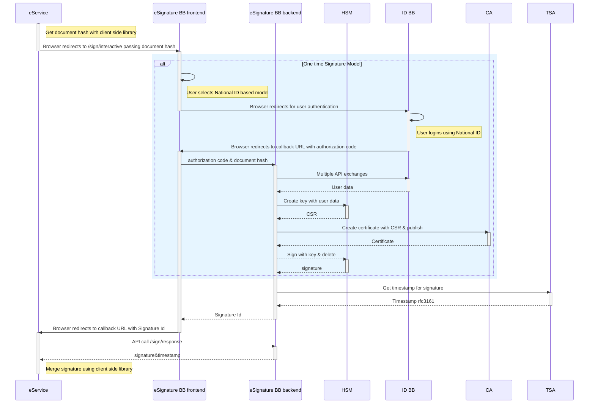
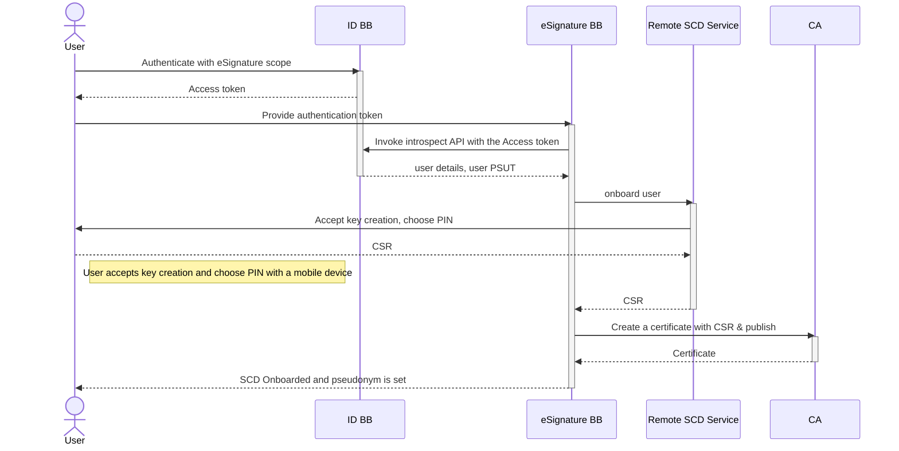
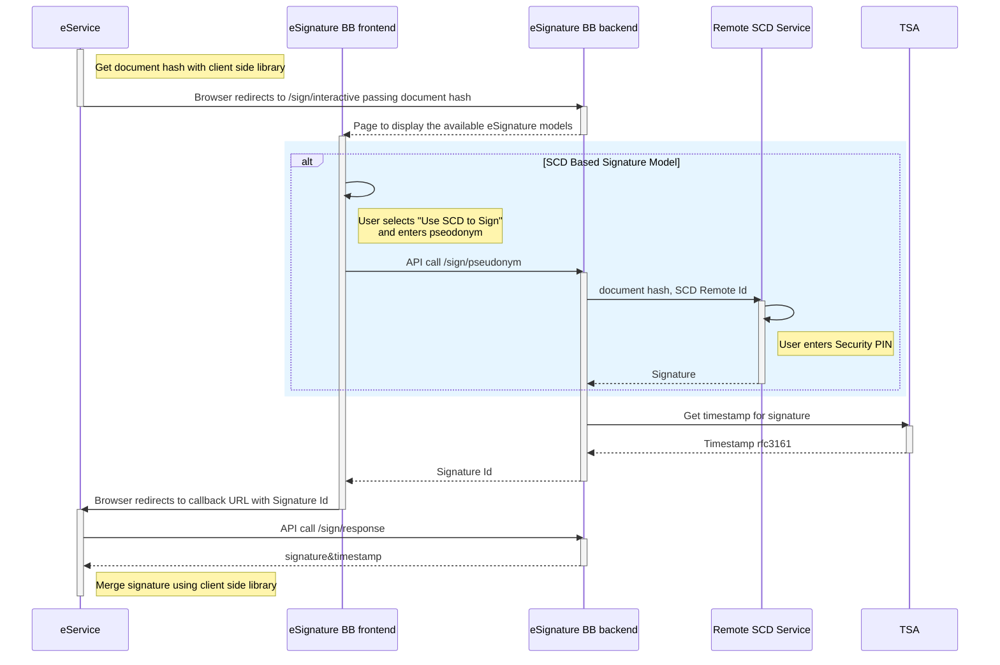

# 9 Internal Workflows

## 9.1 Workflow for onetime signing

This internal workflow is used by the eSignature BB to deliver the onetime signature service. In order to make the sequence diagram easier to follow the eSIgnature BB is divided into frontend and backend parts. Frontend constitutes the functionality running in the user's internet browser and backend is the API running on a server.

Workflow is kicked off by an eService (3rd party service) using the eSignature client library to get a digest of the document to be signed. Using the digest(hash) the redirection request is made towards the eSignature BB frontend. If configured the BB will check that the Payment token supplied by the request is valid, If valid will continue with the workflow if not it should follow the specification set by the payment build block.

In the eSignature BB frontend, the user selects the option to use National ID to perform one-time signature. Then the user is redirected to the Identity BB to authenticate. Upon successful authentication, the user is returned back to the eSignature BB backend.&#x20;

Now the eSignature BB will use a Hardware Security Module (HSM) to generate a temporary keypair. From that keypair, the public part is used to generate a certificate and publish a short-lived (1 minute) certificate based on the supplied CA.

This private part of the key is used to sign  & timestamp the document's digest. The results are saved into a database/cache and a signature token is generated to reference the signature. The signature token is then returned to the eSignature frontend, and the User's flow is redirected back to the eService provider using the callback URL and signature token.

After receiving the signature token the eService provider can exchange the signature token for the actual signature from the eSignature BB backend. After finally receiving the signature, eService can merge it with the original document (Note: The format of the signature is important to merge) to get a signed version of it using the client side library received from the eSignature BB frontend.

## 9.2 Workflows for signing with user's device

In the case of signing in with the user's device, there are multiple workflows

* Register the user's Signature Creation Device (SCD)
* Signing with the user's Signature Creation/Seal Device (SCD)

### 9.2.1 Register user's Signature Creation Device (SCD)

Registering starts with the User authenticating against ID BB. It's expected that the ID BB authenticates and provides the necessary eKYC functionality.  A  strong (presence-based) authentication is recommended. After the user is authenticated, a Remote SCD service is called to onboard the user.

Once the eKYC is successful a request is sent to the user's device to create keys. After keys are generated the public part of keypair is sent to eSignature BB as a Certificate Signing Request (CSR). CSR is then submitted to the CA who will generate and publish a certificate. Officially a unique pseudonym (or a handle) is created. The pseudonym could be auto-created or user can set the same.

### 9.2.2 Use the user's Signature/Seal Creation Device (SCD) for signing

This internal workflow is for signing the document with the user Signature/Seal Creation Device (SCD).

In order to make the sequence diagram easier to follow the eSIgnature BB is divided into frontend and backend parts. Frontend constitutes the functionality running in the user's internet browser and backend is the API running on a server.

First, eService fetches the client side library from the eSignature BB frontend. The client library is used to create a digest of the document to be signed. Using the digest(hash) the redirection request is made towards eSignature BB frontend.&#x20;

In the eSignature BB frontend, the user selects the option to use SCD model. The eSignature BB takes the user to the page requesting the pseudonym. The user enters the pseudonym and the same is sent to the eSignature BB backend. After receiving a pseudonym token, the eSignature BB backend can be invoked to create the signature.

eSignature BB backend will then invoke Remote SCD Service to create the signature. The communication between the eSignature BB and its SCD is not defined and is left to the choice of the implementor.  The SCD could be a remote device, a mobile phone, SIM Card or a smartcard etc. Remote SCD service will send a notification to the user. The user can then accept this and will type the PIN to unlock. After the user enters the PIN, the signature is generated and sent back to the Remote SCD service. Remote SCD Service will then send the signature back to eSignature BB backend.

After the Signature is received, eSignature BB backend will send request to Timestamping Authority for a timestamp on the signature to be created. After timestamp is generated and received on a signature, the results are saved into a database and a signature token is generated to reference the signature data.

The signature token is then returned to eSignature frontend, and the User's flow is redirected back to eService provider using the callback url and signature token.

After receiving the signature token the eService provider can then receive the signature from eSignature BB backend. As an option, the eSignature BB backend can verify the requests coming from the correct IP or use an OAUTH bearer token or use the IM BB to protect.

After receiving the signature, eService can merge it with the original document to get a signed version of it using the client side library received from eSignature BB frontend.

