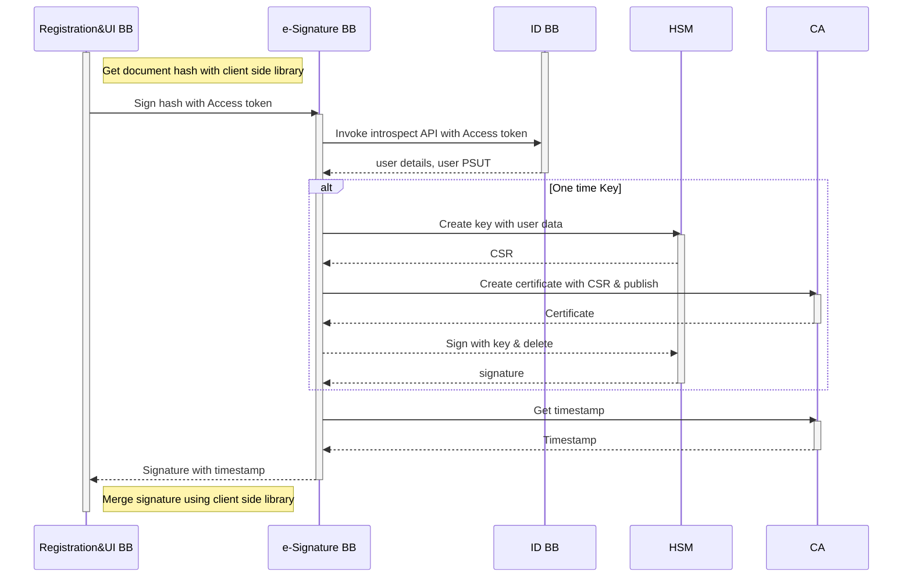
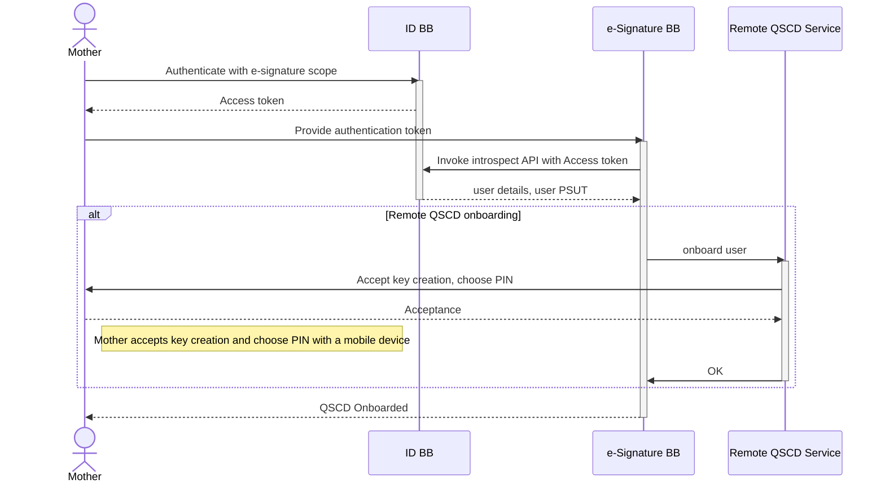

# 9 Internal Workflows

### 9.1 Workflow for onetime signing

This internal workflow is used by the eSignature BB to give onetime signature.

Workflow is kicked off by a 3rd party using eSignature client library to get a digest of document to be signed

After submitting the call to eSignature BB, it will first check if the authentication token by ID BB is valid

If required by the BB configuration, it will also check if the Payment token supplied by the request is valid.

Then a Host Security Module (HSM) hardware is used to generate a temporary keypair. From that keypair, public part is exported as Certificate Signing Request (CSR)

CSR is the submitted to a CA instance that will generate and publish a short lived (1 minute) certificate based on supplied CA.

After certificate has been created the private key in HSM is used to sign a document digest.

After Digest is signed, timestamp is requested on the signature from timestamping service.

After receiving timestamp original 3rd party replied with signature response.

### 9.2 Workflows for signing with user's device

In case of signing with user's device there are multiple workflows

* Register user's Signature Creation Device (SCD)
* Signing with user's Signature Creation Device (SCD)

#### 9.2.1 Register user's Signature Creation Device (SCD)

Registering start with Mother authenticating against ID BB and getting the authentication token.

After user is authenticated, a Remote SCD service is called to onboard user.

There is a request sent to user's device to create keys.

After keys are generated the public part of keypair is sent to eSignature BB as a Certificate Signing Request (CSR).

CSR is the submitted to a CA instance that will generate and publish a certificate based on supplied CA.

